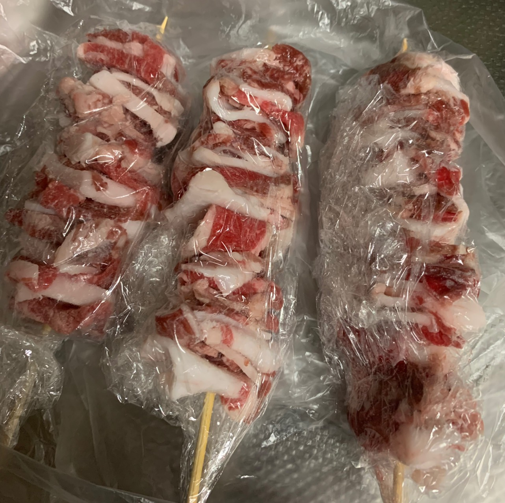
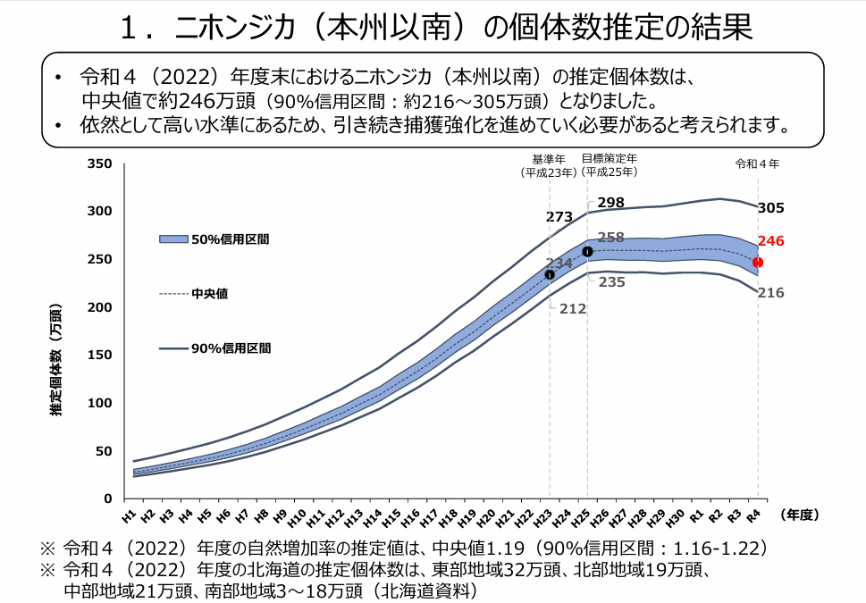

どうも、カイロプラクター兼猟師の喜多です 🍀

今回はジビエについての記事を書いていこうと思います。ただ、いかんせんブログというものを初めて書くのでかなり読みづらい部分が多いかと思います笑

ご了承ください 🙇‍♂️

さて、皆さんはジビエを食べたことありますか？

鹿、猪、鴨、ヤマドリ、熊、穴熊などいろいろありますが、狩猟によって獲っても良い鳥獣は 46 種類と国によってその数が定められています。

現在、その 46 種の内訳は 20 種が獣で 26 種が鳥類と大体半々になっていますが、この内訳は獣や鳥の個体数によって年々変わるものになっています。

例えば僕が免許を取ったばかりの頃（3 年前）はヤマドリの個体数がかなり減っているので狩猟鳥獣から外すようになるかもしれない、という話が講習会で出てた記憶があります。

結局狩猟鳥獣としてまだ獲れるはず(自分が鳥撃ちあんまやってないのでわからない)ですが、ヤマドリは美味しいと聞くので狩猟鳥獣でなくなれば残念がる猟師も多いのではないでしょうか？

ヤマドリはあくまで例でしたが、前述のように狩猟鳥獣というものはまず第一に、国による個体数管理という名目によって決められます。なので仮に「猪を食べたい！」と思っても、猪が絶滅危惧種になる可能性が高いと判断されると普通に狩猟鳥獣から外されます。美味しいから獲るかどうかは二の次なんです。生態系の管理はシビアですね…😓

↑ この前獲った猪を串に刺してケバブにしたもの。冬場に獲れる脂の乗った猪はとても美味しい。
僕の住む伊勢では 30 ～ 40 年前までは大物猟(鹿や猪などの大型動物を狙う狩猟)よりも鳥撃ちが主流だったと鉄砲店の店主から聞かされました。当時の日本はヨーロッパの貴族が行っていたような娯楽としての狩猟が主流で、それが段々、鹿や猪の個体数が増えるに連れてグループ単位で行う大物猟が増えていったそうです。今では日本の猟師の大半が大物猟をメインでやってるんじゃないかなと個人的に思っています。

個体数が劇的に増える例として、ニホンジカの生息数を参考に見てみましょう。全国のニホンジカの生息数はおよそ 35 年前で約 25 万頭だったのが現在では 246 万頭にまで増えたとされてます(図参照)。たった数十年でこれです。驚異的な繁殖力ですね。

『全国のニホンジカ及びイノシシの個体数推定等の結果について | 報道発表資料 | 環境省』より引用
私たち人間と違って野生動物は自ら食料を生み出せません。つまり奪い合いです。ある一定の条件が揃ってしまうと、特定の個体は山を食いつくすまで急激に増え続けてしまいます。生存競争に負けた個体は人里にも現れます。そしてその限界が来ても、自ら食料を生み出せないので個体数が増えれば飢えて死にます。

有史以来、ニホンジカの数が大幅に増えた時期があります。一つは「日本で農耕文化が始まった時期」、もう一つは「ニホンオオカミが絶滅した時期」です。このような要因で、ある特定の種の個体数は圧倒的に増えてしまいます。そして、僕らの地域が鳥撃ちから大物猟へと変遷していった様に、特定の種の個体数の増減はそれまであった狩猟のスタイルまでも変えてしまうことにもなります。

こうして考えると、ジビエというのは単なる「珍しい食材」ではなく、自然環境や生態系のバランスの中で成り立っているものだと実感しますね。
目の前の一皿の裏側には、個体数管理や自然とのせめぎ合いがある。

そう思うと、ジビエの見え方も少し変わってくるのではないでしょうか？
